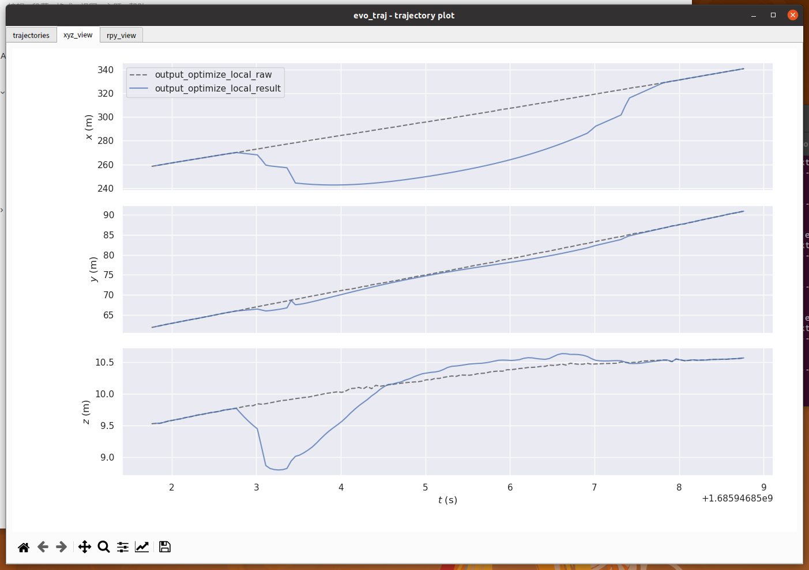
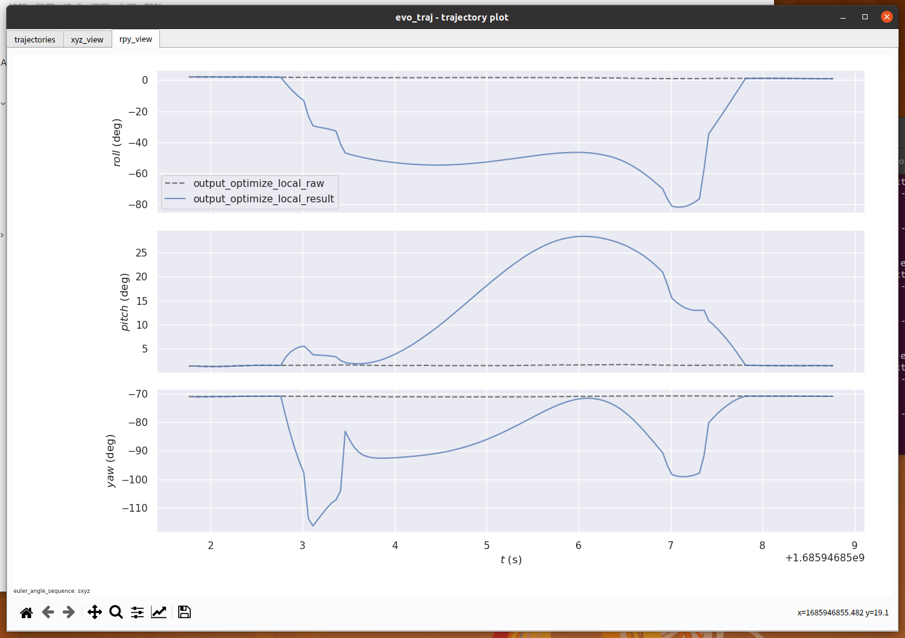
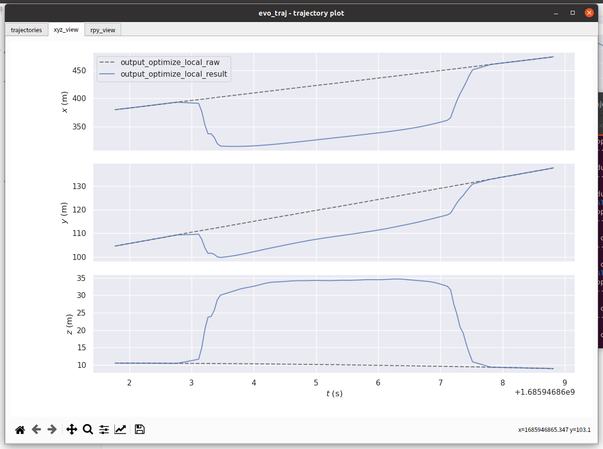

# AlignTrajectory 

## 轨迹补偿

```shell
EXE_PATH=/home/cjq/CLionProjects/SLAM_Tools/AlignTrajectory/bin

${EXE_PATH}/complete_trajectory \
-vins_pose_path /media/cjq/新加卷/datasets/220Dataset/HS5_220_8M/12_bev/20230727174541.191/sfm/colmap_tum_pose.txt \
-op_pose_path /home/cjq/mnt/done_data/12_bev/test/0728/220/20230619_1.93km_LTZJ030/pose_opt/new_pose_2.txt \
-start_index 100 \
-completion_len 100

```


### 可视化结果

```shell
startconda

evo_traj tum /home/cjq/CLionProjects/SLAM_Tools/AlignTrajectory/bin/output_optimize_result.txt --ref=/home/cjq/CLionProjects/SLAM_Tools/AlignTrajectory/bin/output_optimize_raw.txt -p
```


## 公式推导

### 估计旋转外参

已知一个lidar坐标系下的位姿 $\bold{R}_{\text{op}}$ 和IMU坐标系下的位姿 $\bold{R}_{\text{vins}}$ ，求旋转外参数 $\bold{R}_{\text{e}}$ 。由公式：
$$
\bold{R}_{\text{op}} =\bold{R}_{\text{e}} \bold{R}_{\text{vins}}
$$
误差：
$$
e = \ln (\bold{R}_{\text{op}}^{T} \bold{R}_{e} \bold{R}_{\text{vins}})^{\vee}
$$

导数：

$$
\frac{d \ln (\bold{R}_{\text{op}}^{T} \bold{R}_{e} \bold{R}_{\text{vins}})^{\vee} }{d \bold{R}_e} 
= 
\lim_{\Delta \boldsymbol{ \theta} \to 0} { \frac{ 
\ln{(\bold{R}_{\text{op}}^{T} \bold{R}_{\text{e}}  \exp( \Delta \boldsymbol{ \theta}^{ \land } )
\bold{R}_{\text{vins}}
)^{\vee}} 
- \ln{(\bold{R}_{\text{op}}^{T} \bold{R}_{e} \bold{R}_{\text{vins}})^{\vee}} }{\Delta \boldsymbol{ \theta}} }
\\根据BCH的性质，有：
\\
=\lim_{\Delta \boldsymbol{ \theta} \to 0} { \frac{ 
\ln{(\bold{R}_{\text{op}}^{T} \bold{R}_{\text{e}} \bold{R}_{\text{vins}} \exp(( \bold{R}^{T}_{\text{vins}} \Delta \boldsymbol{ \theta})^{ \land } )
)^{\vee}} 
- 
\ln{(\bold{R}_{\text{op}}^{T} \bold{R}_{e} \bold{R}_{\text{vins}})^{\vee}} }{\Delta \boldsymbol{ \theta}} }
\\
=\lim_{\Delta \boldsymbol{\theta} \to 0} { \frac{ 
\ln{(\bold{R}_{\text{op}}^{T} \bold{R}_{\text{e}} \bold{R}_{\text{vins}})^{\vee}} 
+
\bold{J}_r^{-1} \Delta \boldsymbol{\theta} 
- 
\ln{(\bold{R}_{\text{op}}^{T} \bold{R}_{e} \bold{R}_{\text{vins}})^{\vee}} }{\Delta \boldsymbol{ \theta}} }
\\
=\bold{J}_r^{-1}
$$


其中 $\bold{J}_r^{-1}$ 的计算： $\bold{J}_r^{-1} = \bold{J}_r^{-1}( \ln (\bold{R}_{\text{op}}^{T} \bold{R}_{e} \bold{R}_{\text{vins}})^{\vee}  )$ 

和 $\bold{J}^{-1}_{r}$  为 SO(3) 上的右雅可比：
$$
\boldsymbol{J}_r^{-1} (\theta \boldsymbol{\omega}) = \frac{\theta}{2} \cot \frac{\theta}{2} \bold{I} + ( 1 - \frac{\theta}{2} \cot \frac{\theta}{2}) \boldsymbol{\omega} \boldsymbol{\omega} ^{T} + \frac{\theta}{2} \boldsymbol{\omega}^{\land}
$$


### 估计完整外参

已知一个lidar坐标系下的位姿 $\bold{T}_a$ 和IMU坐标系下的位姿 $\bold{T}_b$ ，求旋转外参数 $\bold{T}_{\text{e}}$ 。由公式：
$$
\bold{T}_a =\bold{T}_{\text{e}} \bold{T}_b
$$
误差：
$$
e = \ln (\bold{T}_a^{-1} \bold{T}_{e} \bold{T}_b)^{\vee}
$$

下面将位姿写成 旋转和平移的形式。
$$
\bold{T}_a^{-1} = 
\begin{bmatrix} 
\bold{R}_a & \bold{t}_a \\
\bold{0}^T & 1
\end{bmatrix}^{-1} 
=
\begin{bmatrix} 
\bold{R}_a^T & - \bold{R}_a^T \bold{t}_a \\
\bold{0}^T & 1
\end{bmatrix}
$$
计算 $\bold{T}_a^{T} \bold{T}_{e}$ :
$$
\bold{T}_a^{-1} \bold{T}_e =
\begin{bmatrix} 
\bold{R}_a^T & - \bold{R}_a^T \bold{t}_a \\
\bold{0}^T & 1
\end{bmatrix}
\begin{bmatrix} 
\bold{R}_e & \bold{t}_e \\
\bold{0}^T & 1
\end{bmatrix}
\\=
\begin{bmatrix} 
\bold{R}_a^T \bold{R}_e & \bold{R}_a^T \bold{t}_e -\bold{R}_a^T \bold{t}_a \\
\bold{0}^T & 1
\end{bmatrix}
$$
计算 $\bold{T}_a^{T} \bold{T}_{e} \bold{T}_{b}$ :
$$
\bold{T}_a^{-1} \bold{T}_e \bold{T}_{b}
=
\begin{bmatrix} 
\bold{R}_a^T \bold{R}_e & \bold{R}_a^T \bold{t}_e -\bold{R}_a^T \bold{t}_a \\ \bold{0}^T & 1
\end{bmatrix} 
\begin{bmatrix} 
\bold{R}_b & \bold{t}_b \\ \bold{0}^T & 1
\end{bmatrix} \\
=
\begin{bmatrix} 
\bold{R}_a^T \bold{R}_e \bold{R}_b 
& \bold{R}_a^T \bold{R}_e \bold{t}_b + \bold{R}_a^T \bold{t}_e -\bold{R}_a^T \bold{t}_a \\ \bold{0}^T & 1
\end{bmatrix}
$$


误差方程重写成如下：
$$
\mathbf{e} \in \mathbb{R}^6 = 
\begin{bmatrix} 
\bold{R}_a^T \bold{R}_e \bold{t}_b + \bold{R}_a^T \bold{t}_e -\bold{R}_a^T \bold{t}_a \\
\ln (\bold{R}_a^{T} \bold{R}_e \bold{R}_b)^{\vee} 
\end{bmatrix}
$$


优化变量： $\mathbf{R}_e$ 和 $\mathbf{t}_e$ 

雅可比：


$$
\frac{d \ln (\bold{R}_a^{T} \bold{R}_e \bold{R}_b)^{\vee} }{d \bold{R}_e} 
=\bold{J}_r^{-1} \in \mathbb{R}^{3\times 3}
$$


其中 $\bold{J}_r^{-1}$ 的计算： $\bold{J}_r^{-1} = \bold{J}_r^{-1}( \ln (\bold{R}_a^{T} \bold{R}_e \bold{R}_b)^{\vee}  )$ 
$$
\frac{d \ln (\bold{R}_a^{T} \bold{R}_e \bold{R}_b)^{\vee} }{d \bold{t}_e} = \mathbf{0}  \in \mathbb{R}^{3\times 3}
$$

$$
\frac{d \bold{R}_a^T \bold{R}_e \bold{t}_b + \bold{R}_a^T \bold{t}_e -\bold{R}_a^T \bold{t}_a}{d \mathbf{R}_e}\\
=\frac{d \bold{R}_a^T \bold{R}_e \bold{t}_b }{d \mathbf{R}_e} \\
={\lim\limits_{\Delta \boldsymbol{ \theta}\rightarrow 0}
\frac{\bold{R}_a^T \bold{R}_e \exp( \Delta \boldsymbol{\theta}^{\land}) \bold{t}_b - 
\bold{R}_a^T \bold{R}_e \bold{t}_b
 }{\Delta \boldsymbol{\theta}}} \\
 ={\lim\limits_{\Delta \boldsymbol{ \theta}\rightarrow 0}
\frac{\bold{R}_a^T \bold{R}_e (\mathbf{I}+\Delta \boldsymbol{\theta}^{\land}) \bold{t}_b
 }{\Delta \boldsymbol{\theta}}} \\
  ={\lim\limits_{\Delta \boldsymbol{ \theta}\rightarrow 0}
\frac{\bold{R}_a^T \bold{R}_e \Delta \boldsymbol{\theta}^{\land} \bold{t}_b
 }{\Delta \boldsymbol{\theta}}} \\
   ={\lim\limits_{\Delta \boldsymbol{ \theta}\rightarrow 0}
\frac{ -\bold{R}_a^T \bold{R}_e \bold{t}_b^{\land} \Delta \boldsymbol{\theta}
 }{\Delta \boldsymbol{\theta}}} \\
 =  -\bold{R}_a^T \bold{R}_e \bold{t}_b^{\land} \in \mathbb{R}^{3\times 3}
$$


$$
\frac{d \bold{R}_a^T \bold{R}_e \bold{t}_b + \bold{R}_a^T \bold{t}_e -\bold{R}_a^T \bold{t}_a}{d \mathbf{t}_e} = \bold{R}_a^T \in \mathbb{R}^{3\times 3}
$$


### 相对约束（相反的坐标系定义）

坐标关系：
$$
\mathbf{T}_{w a_{k+1}} = \mathbf{T}_{w a_{k}} \mathbf{T}_{a_{k}a_{k+1}}   \\
\Rightarrow \mathbf{T}_{a_{k}a_{k+1}} = \mathbf{T}_{w a_{k}}^{-1} \mathbf{T}_{w a_{k+1}}
$$
分解为R,t：
$$
\mathbf{T}_{a_{k}a_{k+1}} = \mathbf{T}_{w a_{k}}^{-1} \mathbf{T}_{w a_{k+1}} \\
\Rightarrow 
\begin{bmatrix} \mathbf{R}_{a_{k}a_{k+1}} & \mathbf{t}_{a_{k}a_{k+1}} \\
\mathbf{0}^T & 1
\end{bmatrix} 
=\begin{bmatrix} 
\bold{R}_{w a_{k}}^T & - \bold{R}_{w a_{k}}^T \bold{t}_{w a_{k}} \\
\bold{0}^T & 1
\end{bmatrix}
\begin{bmatrix} \mathbf{R}_{wa_{k+1}} & \mathbf{t}_{wa_{k+1}} \\
\mathbf{0}^T & 1
\end{bmatrix} \\
=\begin{bmatrix} \bold{R}_{w a_{k}}^T \mathbf{R}_{wa_{k+1}} &
\bold{R}_{w a_{k}}^T (\mathbf{t}_{wa_{k+1}} - \bold{t}_{w a_{k}}) \\
\mathbf{0}^T & 1
\end{bmatrix}
$$


### 相对约束

已知关系：
$$
\mathbf{T}_{a_{k+1}w} = \mathbf{T}_{a_{k+1}a_{k}} \mathbf{T}_{a_{k}w}  \\
\Rightarrow \mathbf{T}_{a_{k+1}a_{k}} = \mathbf{T}_{a_{k+1}w} \mathbf{T}_{a_{k}w}^{-1} \\
\Rightarrow \mathbf{T}_{a_{k+1}a_{k}} = \mathbf{T}_{ai} \mathbf{T}_{i_{k+1}w} ( \mathbf{T}_{ai} \mathbf{T}_{i_{k}w} )^{-1}
$$
误差：
$$
\mathbf{T}_{error} = \mathbf{T}_{a_{k+1}w}^{-1} \mathbf{T}_{a_{k+1}a_{k}} \mathbf{T}_{a_{k}w}
$$
李代数误差：
$$
\mathbf{e} = \ln (\bold{T}_a^{-1} \bold{T}_{e} \bold{T}_b)^{\vee}
$$

误差方程重写成如下：
$$
\mathbf{e} \in \mathbb{R}^6 = 
\begin{bmatrix} 
\bold{R}_a^T \bold{R}_e \bold{t}_b + \bold{R}_a^T \bold{t}_e -\bold{R}_a^T \bold{t}_a \\
\ln (\bold{R}_a^{T} \bold{R}_e \bold{R}_b)^{\vee} 
\end{bmatrix}
$$


优化变量： $\mathbf{R}_a$ 和 $\mathbf{t}_a$ ， $\mathbf{R}_b$ 和 $\mathbf{t}_b$ ,  $\mathbf{R}_e$ 和 $\mathbf{t}_e$ 


#### 雅可比

对  $\mathbf{t}_a$ 的导数：
$$
\frac{d \bold{R}_a^T \bold{R}_e \bold{t}_b + \bold{R}_a^T \bold{t}_e -\bold{R}_a^T \bold{t}_a }{d \mathbf{t}_a} \\
= - \bold{R}_a^T 
\tag{1}
$$

$$
\frac{d \ln (\bold{R}_a^{T} \bold{R}_e \bold{R}_b)^{\vee}  }{d \mathbf{t}_a} = \mathbf{0} 
\tag{2}
$$

对  $\mathbf{R}_a$ 的导数：
$$
\frac{d \bold{R}_a^T \bold{R}_e \bold{t}_b + \bold{R}_a^T \bold{t}_e -\bold{R}_a^T \bold{t}_a }{d \mathbf{R}_a} \\
=\frac{d \bold{R}_a^T (\bold{R}_e \bold{t}_b + \bold{t}_e - \bold{t}_a)   }{d \mathbf{R}_a} \\
={\lim\limits_{\Delta \boldsymbol{ \theta}\rightarrow 0}
\frac{ 
(\bold{R}_a \exp{(\Delta \theta^{\land})})^{-1} (\bold{R}_e \bold{t}_b + \bold{t}_e - \bold{t}_a)
 }{\Delta \boldsymbol{\theta}}}\\
={\lim\limits_{\Delta \boldsymbol{ \theta}\rightarrow 0}
\frac{ 
\exp{(\Delta \theta^{\land})}^{-1} \bold{R}_a^{-1} (\bold{R}_e \bold{t}_b + \bold{t}_e - \bold{t}_a)
 }{\Delta \boldsymbol{\theta}}}\\
=-{\lim\limits_{\Delta \boldsymbol{ \theta}\rightarrow 0}
\frac{ 
\Delta \theta^{\land} \bold{R}_a^{-1} (\bold{R}_e \bold{t}_b + \bold{t}_e - \bold{t}_a)
 }{\Delta \boldsymbol{\theta}}}\\
 ={\lim\limits_{\Delta \boldsymbol{ \theta}\rightarrow 0}
\frac{ 
(\bold{R}_a^{-1} (\bold{R}_e \bold{t}_b + \bold{t}_e - \bold{t}_a)) ^{\land} \Delta \theta 
 }{\Delta \boldsymbol{\theta}}}\\
 =(\bold{R}_a^{-1} (\bold{R}_e \bold{t}_b + \bold{t}_e - \bold{t}_a)) ^{\land}
\tag{3}
$$

$$
\frac{d \ln (\bold{R}_a^{T} \bold{R}_e \bold{R}_b)^{\vee}  }{d \mathbf{R}_a} \\
={\lim\limits_{\Delta \boldsymbol{ \theta}\rightarrow 0}
\frac{
\ln ((\bold{R}_a \exp{(\Delta \theta ^{\land})})^{-1} \bold{R}_e \bold{R}_b)^{\vee}
- \ln (\bold{R}_a^{T} \bold{R}_e \bold{R}_b)^{\vee} 
 }{\Delta \boldsymbol{\theta}}} \\
={\lim\limits_{\Delta \boldsymbol{ \theta}\rightarrow 0}
\frac{
\ln ( ~ \exp{(\Delta \theta ^{\land})}^{-1} \bold{R}_a^{-1} \bold{R}_e \bold{R}_b)^{\vee}
- \ln (\bold{R}_a^{T} \bold{R}_e \bold{R}_b)^{\vee} 
 }{\Delta \boldsymbol{\theta}}} \\
 \text{根据伴随矩阵的性质，有} \\
={\lim\limits_{\Delta \boldsymbol{ \theta}\rightarrow 0}
\frac{
\ln ( ~ \bold{R}_a^{-1} \bold{R}_e \bold{R}_b  \exp{( (\bold{R}_a^{-1} \bold{R}_e \bold{R}_b)^T  \Delta \theta ^{\land})}^{-1}   )^{\vee}
- \ln (\bold{R}_a^{T} \bold{R}_e \bold{R}_b)^{\vee} 
 }{\Delta \boldsymbol{\theta}}} \\
={\lim\limits_{\Delta \boldsymbol{ \theta}\rightarrow 0}
\frac{
\ln ( ~ \bold{R}_a^{-1} \bold{R}_e \bold{R}_b  \exp{( -(\bold{R}_a^{-1} \bold{R}_e \bold{R}_b)^T  \Delta \theta ^{\land})}   )^{\vee}
- \ln (\bold{R}_a^{T} \bold{R}_e \bold{R}_b)^{\vee} 
 }{\Delta \boldsymbol{\theta}}} \\
\text{根据BCH公式，有} \\
={\lim\limits_{\Delta \boldsymbol{ \theta}\rightarrow 0}
\frac{
\mathbf{J}_r^{-1} \times ( -(\bold{R}_a^{-1} \bold{R}_e \bold{R}_b)^T  \Delta \theta)
}{\Delta \boldsymbol{\theta}}} \\
= - \mathbf{J}_r^{-1} \times (\bold{R}_a^{-1} \bold{R}_e \bold{R}_b)^T
\tag{4}
$$
其中 $\mathbf{J}_r^{-1} = \mathbf{J}_r^{-1}( \ln (\bold{R}_a^{T} \bold{R}_e \bold{R}_b)^{\vee} )$ 


对  $\mathbf{t}_b$ 的导数：
$$
\frac{d \bold{R}_a^T \bold{R}_e \bold{t}_b + \bold{R}_a^T \bold{t}_e -\bold{R}_a^T \bold{t}_a }{d \mathbf{t}_b} \\
= \bold{R}_a^T \bold{R}_e
\tag{5}
$$

$$
\frac{d \ln (\bold{R}_a^{T} \bold{R}_e \bold{R}_b)^{\vee}  }{d \mathbf{t}_b} = \mathbf{0} 
\tag{6}
$$

对  $\mathbf{R}_b$ 的导数：
$$
\frac{d \bold{R}_a^T \bold{R}_e \bold{t}_b + \bold{R}_a^T \bold{t}_e -\bold{R}_a^T \bold{t}_a }{d \mathbf{R}_b} \\
= \mathbf{0} 
\tag{7}
$$

$$
\frac{d \ln (\bold{R}_a^{T} \bold{R}_e \bold{R}_b)^{\vee}  }{d \mathbf{R}_b} \\
={\lim\limits_{\Delta \boldsymbol{ \theta}\rightarrow 0}
\frac{
\ln ( \bold{R}_a^{-1} \bold{R}_e \bold{R}_b \exp{(\Delta \theta ^{\land})} )^{\vee}
- \ln (\bold{R}_a^{T} \bold{R}_e \bold{R}_b)^{\vee} 
 }{\Delta \boldsymbol{\theta}}} \\
= \mathbf{J}_r^{-1}
\tag{8}
$$
其中： $\mathbf{J}_r^{-1} = \mathbf{J}_r^{-1}( \ln (\bold{R}_a^{T} \bold{R}_e \bold{R}_b)^{\vee} )$ 。


对 $\mathbf{R}_e$ 


雅可比：


$$
\frac{d \ln (\bold{R}_a^{T} \bold{R}_e \bold{R}_b)^{\vee} }{d \bold{R}_e} 
=\bold{J}_r^{-1} \in \mathbb{R}^{3\times 3}
$$


其中 $\bold{J}_r^{-1}$ 的计算： $\bold{J}_r^{-1} = \bold{J}_r^{-1}( \ln (\bold{R}_a^{T} \bold{R}_e \bold{R}_b)^{\vee}  )$ 
$$
\frac{d \ln (\bold{R}_a^{T} \bold{R}_e \bold{R}_b)^{\vee} }{d \bold{t}_e} = \mathbf{0}  \in \mathbb{R}^{3\times 3}
$$

$$
\frac{d \bold{R}_a^T \bold{R}_e \bold{t}_b + \bold{R}_a^T \bold{t}_e -\bold{R}_a^T \bold{t}_a}{d \mathbf{R}_e}\\
=\frac{d \bold{R}_a^T \bold{R}_e \bold{t}_b }{d \mathbf{R}_e} \\
={\lim\limits_{\Delta \boldsymbol{ \theta}\rightarrow 0}
\frac{\bold{R}_a^T \bold{R}_e \exp( \Delta \boldsymbol{\theta}^{\land}) \bold{t}_b - 
\bold{R}_a^T \bold{R}_e \bold{t}_b
 }{\Delta \boldsymbol{\theta}}} \\
 ={\lim\limits_{\Delta \boldsymbol{ \theta}\rightarrow 0}
\frac{\bold{R}_a^T \bold{R}_e (\mathbf{I}+\Delta \boldsymbol{\theta}^{\land}) \bold{t}_b
 }{\Delta \boldsymbol{\theta}}} \\
  ={\lim\limits_{\Delta \boldsymbol{ \theta}\rightarrow 0}
\frac{\bold{R}_a^T \bold{R}_e \Delta \boldsymbol{\theta}^{\land} \bold{t}_b
 }{\Delta \boldsymbol{\theta}}} \\
   ={\lim\limits_{\Delta \boldsymbol{ \theta}\rightarrow 0}
\frac{ -\bold{R}_a^T \bold{R}_e \bold{t}_b^{\land} \Delta \boldsymbol{\theta}
 }{\Delta \boldsymbol{\theta}}} \\
 =  -\bold{R}_a^T \bold{R}_e \bold{t}_b^{\land} \in \mathbb{R}^{3\times 3}
$$


$$
\frac{d \bold{R}_a^T \bold{R}_e \bold{t}_b + \bold{R}_a^T \bold{t}_e -\bold{R}_a^T \bold{t}_a}{d \mathbf{t}_e} = \bold{R}_a^T \in \mathbb{R}^{3\times 3}
$$


## 位姿递推

$$
\mathbf{T}_{aw} = \mathbf{T}_{ai} \mathbf{T}_{iw} \tag{1}
$$

$$
\mathbf{T}_{a_{k+1}w} = \mathbf{T}_{a_{k+1}a_{k}} \mathbf{T}_{a_{k}w} \tag{2}
$$

$$
\mathbf{T}_{a_{k+1}a_{k}} = \mathbf{T}_{ai} \mathbf{T}_{i_{k+1}w}   \mathbf{T}_{w i_{k}} \mathbf{T}_{ia}
\tag{3}
$$

$$
\mathbf{T}_{a_{k+1}w} = \mathbf{T}_{a_{k+1}a_{k}} \mathbf{T}_{a_{k}w}  \\
\Rightarrow
\mathbf{T}_{a_{k+1}w} = \mathbf{T}_{ai} \mathbf{T}_{i_{k+1}w}   \mathbf{T}_{w i_{k}} \mathbf{T}_{ia} \mathbf{T}_{a_{k}w}
\tag{4}
$$


## 实验

### 发散的轨迹段

#### 400-500

* 开始帧400，补全长度：100帧

```shell
[2023-08-01 17:04:14.193] [info] [complete_trajectory.cpp:507] T_begin time:1685946852.764000
[2023-08-01 17:04:14.193] [info] [complete_trajectory.cpp:508] T_end time:1685946857.814000

Ceres Solver Report: Iterations: 101, Initial cost: 9.656450e+04, Final cost: 5.809431e+01, Termination: NO_CONVERGENCE
Solver Summary (v 2.0.0-eigen-(3.3.7)-lapack-suitesparse-(5.7.1)-cxsparse-(3.2.0)-eigensparse-no_openmp)

                                     Original                  Reduced
Parameter blocks                          102                      100
Parameters                                714                      700
Effective parameters                      612                      600
Residual blocks                           101                      101
Residuals                                 606                      606

Minimizer                        TRUST_REGION

Dense linear algebra library            EIGEN
Trust region strategy     LEVENBERG_MARQUARDT

                                        Given                     Used
Linear solver                        DENSE_QR                 DENSE_QR
Threads                                     1                        1
Linear solver ordering              AUTOMATIC                      100

Cost:
Initial                          9.656450e+04
Final                            5.809431e+01
Change                           9.650640e+04

Minimizer iterations                      101
Successful steps                           88
Unsuccessful steps                         13

Time (in seconds):
Preprocessor                         0.002048

  Residual only evaluation           0.052526 (100)
  Jacobian & residual evaluation     0.231522 (88)
  Linear solver                      3.465157 (100)
Minimizer                            3.842295

Postprocessor                        0.000079
Total                                3.844422

Termination:                   NO_CONVERGENCE (Maximum number of iterations reached. Number of iterations: 100.)

```








#### 600-700

```shell
```





#### 700-800


#### 800-900


#### 900-1000


